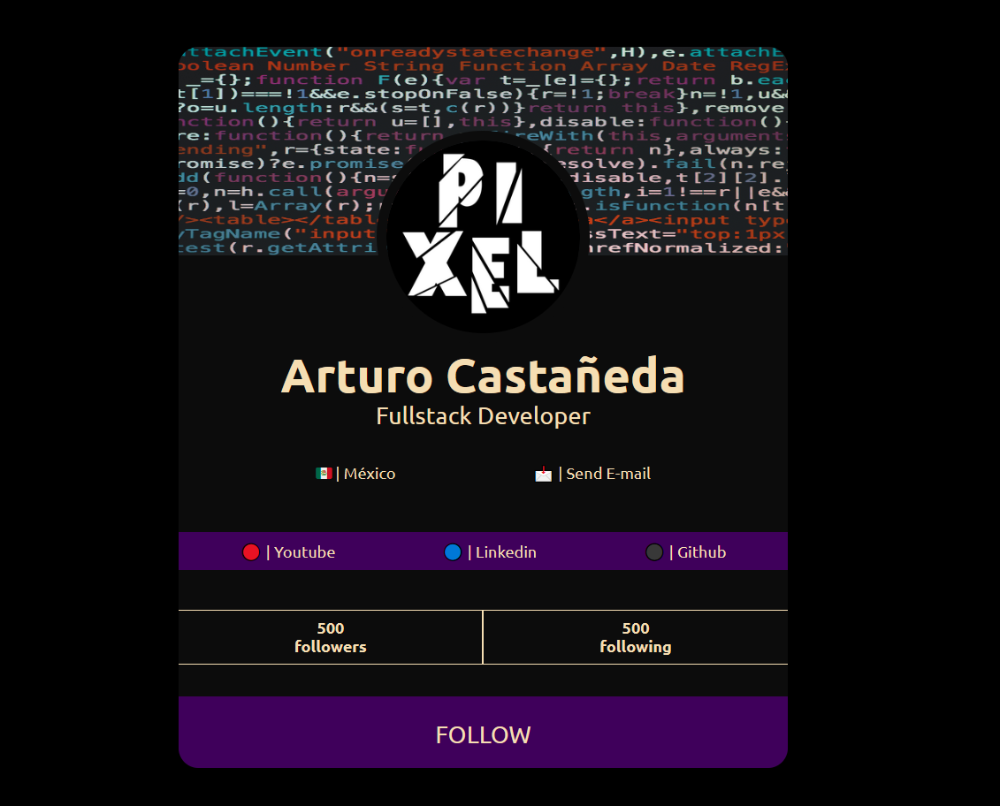

# Carta de información sencilla y con estilo minimalista[👨‍💻][git]

[

][yt]

### Made with 🔨

<a href="https://devdocs.io/html/" target="_blank">

<a/>
  
<a href="https://devdocs.io/css/" target="_blank">

<a/>

 

### Card 🖥️

[git]: https://github.com/Pixe-L
[yt]: https://www.youtube.com/c/TUTOSPIXEL/join
